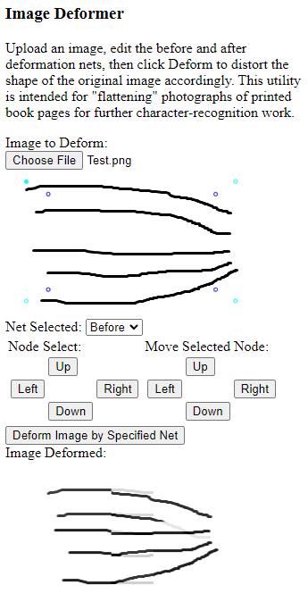

ImageDeformer
=============

The JavaScript code in this repository partially implements an Image Deformer. 
The user provides an image and before and after "nets", and it distorts the image
accordingly.

This is intended to be used to "flatten" scans of book pages for further
optical character recognition processing.

This is a work in progress.

